# consultas2_sql

base de datos empresa 

# empleados

# departamentos

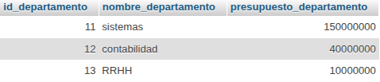

# apellidos de los empleados

`SELECT apellidos_empleado FROM Empleado;`

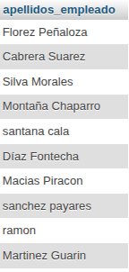

# apellidos de los empleados sin repeticion 

`SELECT DISTINCT apellidos_empleado FROM Empleado;`

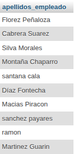

# los empleados que se apelliden gomez

`SELECT * FROM Empleado WHERE apellidos_empleado = 'Gomez';`

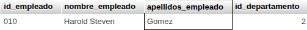

# los empleados con los apellidos dias y rodrigues 

` SELECT *
FROM Empleado WHERE apellidos_empleado LIKE 'Diaz%' OR apellidos_empleado LIKE 'Rodriguez%'; `

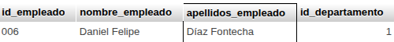

# Obtener los nombres de los empleados que trabajan en el departamento 11

` SELECT nombre_empleado FROM Empleado WHERE id_departamento = 11; `

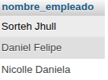

# listado de los empleados que tengan un apellido que empiece por s

SELECT * FROM Empleado WHERE apellidos_empleado LIKE 'S%';

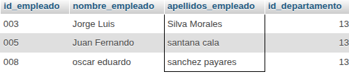

# presupuesto total de los departamentos

`SELECT SUM(presupuesto_departamento) AS presupuesto_total FROM Departamento;`

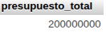

# numero de empleados de cada departamento

`SELECT id_departamento, COUNT(*) AS numero_empleados FROM Empleado GROUP BY id_departamento`

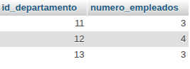

# los datos de cada empleado con los datos de su departamento

`SELECT * FROM Empleado e JOIN Departamento d ON e.id_departamento = d.id_departamento;`

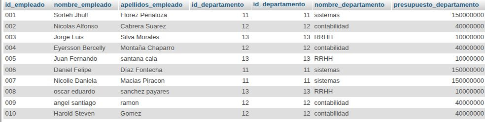

# los datos de los empleados junto con el presupuesto de su departamento

`SELECT e.nombre_empleado, e.apellidos_empleado, d.nombre_departamento, d.presupuesto_departamento FROM Empleado e JOIN Departamento d ON e.id_departamento = d.id_departamento;`

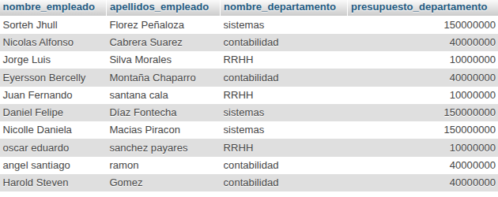

# los empleados cuyo departamento tenga un presupuesto mayor a 10000000

`SELECT e.nombre_empleado, e.apellidos_empleado FROM Empleado e JOIN Departamento d ON e.id_departamento = d.id_departamento WHERE d.presupuesto_departamento > 100000000;`

